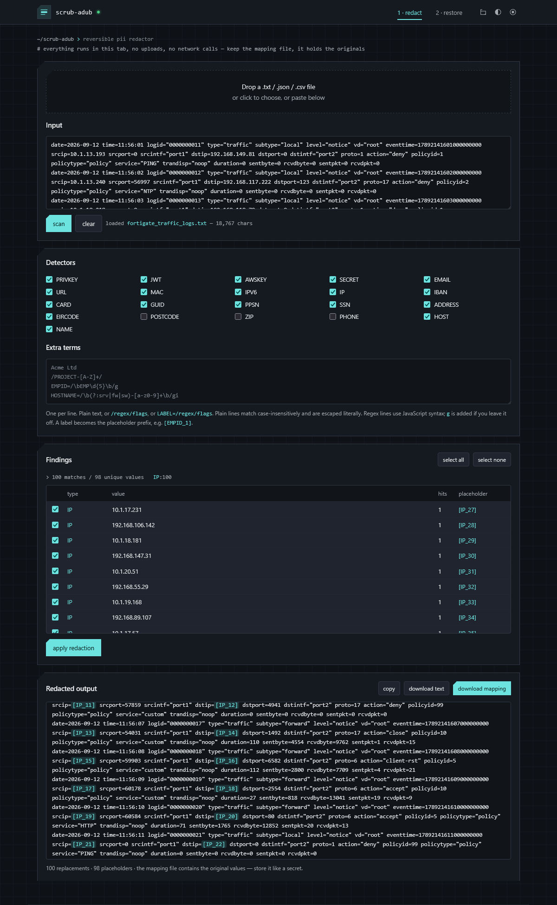

# scrub-adub

**Reversible PII redaction, entirely in your browser.**

Strip names, addresses, IPs, secrets and anything else you don't want leaving the building out of a file, paste the redacted version into an untrusted LLM, then decode the model's response back to the real values.

One HTML file. No build step, no dependencies, no server, no network calls. Open it and it works.



---

## Why

You want an LLM to summarise an incident report, refactor a config, or explain a log — but the input is full of customer names, internal hostnames and credentials. Pasting it is a data disclosure. Manually search-and-replacing it is tedious and you lose the ability to map the answer back.

scrub does both halves:

1. **Redact** — detect sensitive values, replace each with a stable placeholder like `[NAME_1]` or `[IP_3]`, and emit a mapping file.
2. **Restore** — feed the model's output plus the mapping back in, and every placeholder becomes the original value again.

The mapping file never leaves your machine. Neither does anything else.

---

## Usage

```
git clone https://github.com/shanemc92/scrub.git
cd scrub
xdg-open index.html      # or just double-click it
```

Hosting it is equally easy — drop `index.html` on any static host.

### Redact

1. Drop a `.txt`, `.json`, `.csv` or `.log` file, or paste text directly.
2. Review the findings table. Everything is selected by default; untick anything that's a false positive.
3. **Apply redaction**, then download the redacted text and the mapping JSON.

### Restore

1. Drop the mapping JSON.
2. Paste the LLM's response.
3. **Restore.** Anything in the response that wasn't in the mapping is flagged so you can see what the model invented.

---

## Demo data

Three sample files live in [`examples/`](examples/). Or paste one of these straight in.

### Free text

```
Raised by: Ciara Walsh (ciara.walsh@northgate-labs.ie), +353 87 419 2288
At 09:14 a workstation on the finance VLAN (10.44.12.87, MAC 00:1A:2B:3C:4D:5E)
began beaconing to srv-fin02.northgate.internal every 45 seconds.
Rotated the credential (api_key: sk-live-8f2Ba91cD73eF04gH55i).
Refund account IE29 AIBK 9311 5212 3456 78 unchanged.
```

Detects: `NAME`, `EMAIL`, `PHONE`, `IP`, `MAC`, `HOST`, `SECRET`, `IBAN`.

### CSV

```csv
employee_id,full_name,email,department,manager,workstation,ip_address
EMP01021,Ciara Walsh,ciara.walsh@northgate-labs.ie,Finance,Sean Doyle,LAP-4417,10.44.12.87
EMP01044,Tomasz Nowak,tomasz.nowak@northgate-labs.ie,Security Operations,Emma Walsh,LAP-9902,10.44.9.31
```

The regex detectors catch the names, emails and IPs on their own. `workstation` and `employee_id` have no obvious pattern — tick those columns in **Structured fields** and every value in them gets replaced too.

### JSON

```json
{
  "tickets": [
    { "id": "INC0042719", "requester": "Ciara Walsh", "asset": "LAP-4417", "cost_centre": "FIN-NORTH-02" },
    { "id": "INC0042733", "requester": "Aoife Byrne", "asset": "LAP-2210", "cost_centre": "FIN-NORTH-02" }
  ]
}
```

Structured fields lists `tickets[].asset` and `tickets[].cost_centre` as selectable paths. Keys are never touched, so the structure survives and the model still understands the shape.

### Round trip

Redact the free-text sample, then paste something like this into **Restore** with the mapping loaded:

```
[NAME_1] should be contacted at [EMAIL_1] to confirm whether [HOST_1] was
reachable from [IP_1] before the credential was rotated.
```

---

## Detectors

| Detector | Notes |
|---|---|
| `TERM` | Your own literal terms and regexes. Highest priority. |
| `PRIVKEY` | PEM private key blocks |
| `JWT` | Three-part base64url tokens |
| `AWSKEY` | `AKIA` / `ASIA` / `AIza` prefixed keys |
| `SECRET` | Values assigned to `password`, `api_key`, `token`, `secret`, `bearer`… |
| `EMAIL`, `URL`, `HOST` | Hostnames matched against a TLD list, including `.local` / `.internal` / `.corp` |
| `MAC`, `IP`, `IPV6` | IPv6 handles `::` compression; clock times and MACs won't be mistaken for it |
| `IBAN`, `CARD` | Card numbers are Luhn-validated |
| `GUID`, `PPSN`, `SSN` | |
| `ADDRESS`, `EIRCODE`, `POSTCODE`, `ZIP` | `POSTCODE` and `ZIP` are **off by default** — far too noisy against real data |
| `PHONE` | 9–15 digits, international and local formats |
| `NAME` | Capitalised word pairs, filtered through a stoplist |

Every detector is individually toggleable, and every match is reviewable before anything is written.

### Custom terms and regex

The extra terms box takes three line formats:

```
Acme Ltd                        plain text — escaped, case-insensitive
/PROJECT-[A-Z]+/                regex     -> [TERM_1]
EMPID=/\bEMP\d{5}\b/g           labelled  -> [EMPID_1]
```

Standard JavaScript regex syntax. `g` is added if you leave it off. Malformed lines are skipped and reported rather than failing the scan.

### Structured fields

When the input parses as CSV or JSON, every column or leaf path becomes selectable. Ticking one replaces **all** of its values, whatever they look like — for the identifiers, codes and internal references that no regex will ever reliably catch.

Selected values are matched across the whole document, not just inside that column, so the same name appearing in a free-text note field is redacted consistently and reverses consistently.

---

## Known limitations

Read these before trusting it with anything that matters.

- **`NAME` is a heuristic**, not an NER model. It catches capitalised word pairs and filters them through a stoplist. It will find "Sarah Nolan" and occasionally also flag "Firewall Audit". Single-word items — a city, a codename, a surname on its own — it will miss entirely. Use the extra terms box for those.
- **Review the findings table.** It exists because no regex pack is complete. Untick the noise, and add what was missed before you apply.
- **The mapping file is the sensitive artifact.** It is plaintext JSON containing every original value. It never leaves the browser, but it does land in your downloads folder. Treat it accordingly and delete it when you're done.
- **Redaction is not anonymisation.** Structure, timing and context often re-identify people on their own. This tool reduces disclosure; it does not eliminate it.
- **Placeholder survival isn't guaranteed.** Models occasionally reformat or paraphrase placeholders. Restore matches leniently (bracketed, unbracketed, stray whitespace) and reports any placeholder in the response that wasn't in the mapping.

---

## Privacy

There is no backend. No analytics, no telemetry, no storage beyond a single `localStorage` key remembering your theme choice.

The only outbound request in the file is the Google Fonts stylesheet in `<head>`. Delete those three `<link>` lines and it falls back to system fonts and runs fully offline, air-gapped, from a USB stick, wherever.

## Appearance

Three independent controls in the top bar, each saved separately, so changing
one never resets the others.

**Design** sets the shape language, surface hue and backdrop texture:

| Design | Shape | Backdrop |
|---|---|---|
| `chamfer` | Cut corners | Instrument grid. The default |
| `console` | Square, graphite | Horizontal scan rules |
| `circuit` | Slight radius, board green | Via holes, copper edge |
| `contour` | Soft radii, violet | A single accent wash |

**Mode** sets the lightness ramp only, and every design supports every mode:

| Mode | Base |
|---|---|
| `dark` | Lights off. The default |
| `dusk` | Dark, lifted off black, for long sessions |
| `sepia` | Warm paper, bright but low glare |
| `light` | Cool white, closest to print |

**Accent** is any hue. Eight presets are offered, plus a hue/chroma wheel and a
hex field for matching a brand colour exactly.

That is sixteen design-and-mode combinations, on any accent.

Geometry is deliberately shared: every design uses the same bar height, panel
padding, control padding, type sizes and grid, so switching design changes
colour, radius and ornament without reflowing the page.

The accent's lightness is not taken from the picker. The mode proposes a
starting lightness, then the accent is walked away from the surface it sits on
until it clears a measured contrast ratio. HSL lightness is not perceptual, so
a fixed value would leave some hues washed out on white and others muddy on
black; measuring instead is what lets any hue, including a near-white or
near-black pick, stay readable. Status colours (`--ok`, `--warn`, `--bad`)
stay semantic and are kept clear of the accent range, so the accent never
reads as state.

Printing forces one light palette regardless of design and mode, drops the
backdrop texture and the bar controls, and keeps the bar as a masthead so the
logo and tool name land on the page.

## Deployment

`_headers` (Netlify, Cloudflare Pages) and `.htaccess` (Apache) carry the same
CSP and hardening headers. Neither is needed to run the file locally, including
from `file://`.

## Licence

MIT. See `LICENSE`.
